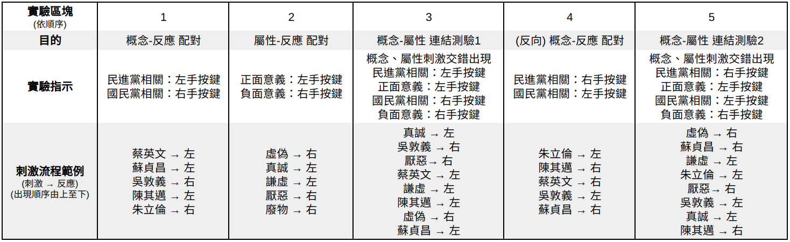

[](https://travis-ci.org/pbciat/pbc-final)

# IAT: DPP vs. KMT


## Dependencies

需使用 `Python 3.5+`，並且安裝 [`websockets`](https://websockets.readthedocs.io/) 套件:

```bash
pip install websockets
```

## 執行

### For Developers

如果電腦上已有此 repo，請使用依照下方步驟執行程式 (working directory 為此 repo)：

1. 在 Terminal 執行

    ```bash
    python3 __main__.py
    ```

2. 使用 chrome 開啟 `front-end/index.html`


### Mac or Linux

1. 下載 [server.zip](https://pbciat.github.io/server.zip)

2. 在 Terminal 執行下方指令：

    ```bash
    python3 path/to/server.zip
    ```

3. 前往 https://pbciat.github.io


#### 步驟 2. Alternative:

```bash
curl https://pbciat.github.io/server.zip > temp.zip
python3 temp.zip || rm temp.zip
```

### Windows

1. 下載 [server.zip](https://pbciat.github.io/server.zip)

2. 在命令提示字元執行 `server.py`：
    
    ```bash
    python C:\<path>\server.zip
    ```

3. 前往 https://pbciat.github.io


## News

大家可以下載來測試看看

* `@OoAllen` Terminal 版本的程式：[Final Project.py](legacy/Final%20Project.py) (Works only on Windows)

* `@liao961120` GUI 測試: [front-end](front-end)

## About

[書面報告](https://pbciat.github.io/report.pdf)




### Client-side Design

- 每個數字對應到 1 種 block
- 每種 block 有一個 JS 函數處理 (決定如何呈現 `server.py` 傳來的 `Stim` obj)


